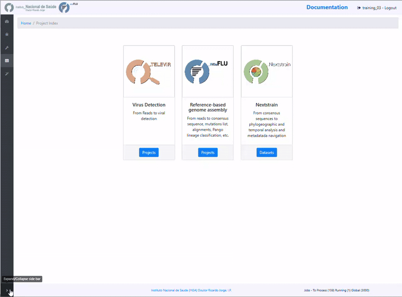
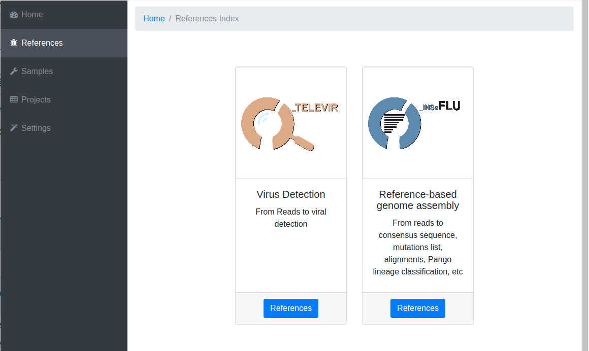
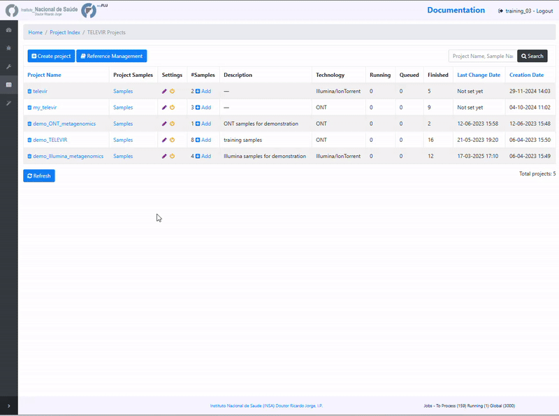

**Metagenomics virus detection**
=================================

.. image:: _static/televir_logo.png

The TELEVIR  bioinformatics component of INSaFLU is a modular pipeline for the identification of viral sequences in metagenomic data (both Illumina and ONT data). 

The TELEVIR module is intended for the detection of viral sequences in metagenomic data, and it is designed to be used in a clinical virology context. In this context, TELEVIR emphasises 
the validation of results and the exclusion of False Positives, through the integration of diagnostic-origented metrics and visualizations.

For identifying candidate metagenomic hits, TELEVIR makes available to the user a combination of classification algorithms and reference databases - together with pre-processing steps designed to 
increase the sensitivy and specificity of the detection - and promotes the simultanous deployment of several approaches, to further potentiate detection through cross-validation.

Alternatively, TELEVIR can be used to directly validate or disprove the presence of suspected viruses in a sample through mapping, and facilitates the comparison of test samples with negative/positive controls.

The TELEVIR module is makes available the following main steps (detailed in https://insaflu.readthedocs.io/en/latest/bioinformatics_pipeline.html#metagenomics-virus-detection):

1. Read quality analysis and improvement [optional].
2. Extra filtering [optional].
3. Viral Enrichment [optional].
4. Host Depletion [optional].
5. *De novo* Assembly of the reads [optional].
6. Identification of the viral sequences.
	- Using reads.
	- Using contigs (if assembled).
	- Using several reference databases.
7. Selection of viral TAXID and representative genome sequences for confirmatory re-mapping.
8. Remapping of the viral sequences against selected reference genomes. 
9. Reporting.

The following table provides an overview on all TELEVIR modules and outputs:

:download:`TELEVIR_current_modules_and_outputs_2023-10-20.xlsx <_static/TELEVIR_current_modules_and_outputs_2023-10-20.xlsx>`

**TELEVIR Validation** - Evaluating a candidate viral Hit.
++++++++++++++++++++++++++++++++++++++++++++++++++++++++++++

Despite the use of multiple classification algorithms and reference databases, our analyses show that even in combination the user can expect a rate of false positives
of 20 % (depending on sample and virus). This is why the TELEVIR module places special emphasis on the validation of results and the exclusion of False Positives. 

Validation is done through mapping the original reads onto the genomes of candidate viruses. The first layer consists in analysing the metrics and visualizations obtained. 
The second layer consists in comparing results between samples and controls. 

Below, you can find a description of the main outputs and statistics.

**Mapping statistics**
----------------------

- **Cov (%)**: horizontal coverage (i.e., percentage of the reference sequence covered)
- **Depth**: mean depth of coverage throughout the whole genome
- **DepthC**: mean depth of coverage exclusively in the covered regions
- **Mapped reads**: number of mapped reads
- **start prop (%)**:   number of mapped mapped reads divided by the number of input reads (after QC)
- **mapped_prop (%)**: number of mapped reads divided by the number of reads used for mapping (i.e., reads retained after the "Virus enrichment" and/or "host depletion steps)
- **Gaps**: number of regions below the minimum coverage threshold (see note below)
- **Windows Covered**: proportion of windows with mapped reads. Reference sequences are split into windows (x), with window size and number (x) being a function of sequence length, from a minimum of 3 up to a maximum of 10. Window number (x) is calculated as the equal division of sequence length by 2000 (without remainder), i.e., sequences <8KB and >20KB result in 3 and 10 windows, respectively.
- **class. success**:  indication of whether the TAXID was selected for mapping after reads and/or contigs classification
- **mapping success**: indication of whether reads/and contigs successfully mapped against the TAXID representative references sequence

- **Warnings**: 
	
Flag-type "viruses" (oriented to shotgun metagenomics)  (default)

- *"Likely False Positive"*: when most reads map to a very small region of the reference sequence, i.e., hits with high “DepthC" but low “Depth” and low "Cov (%)". Flagged for hits with DepthC / Depth > 10 and Cov (%) < 5%.
- *"Vestigial Mapping"*: when only a vestigial amount of reads (<= 2) mapped.

Flag-type **"probes"** (oriented to probe-based NGS target panels)

- *"Likely False Positive"*: when the reference genome is not sufficiently covered as a function of the number of the proportion of Windows Covered, calculated as above. Flagged for hits with Windows Covered <= 50 % (calculated from the fraction presented)
- *"Vestigial Mapping"*: when only a vestigial amount of reads (<= 2) mapped.

.. note::
  - **Cov** is considered only above a minimum **Depth** threshold. By default, this threshold is set to 1 for ONT data, and to 2 for Illumina data.
  - For ONT, secondary mappings are suppressed during the re-mapping step. However, supplementary alignments (split or chimeric alignments) are not suppressed , since these can be informative. This behaviour can result in higher coverage than the number of reads mapped. 	

**Mapping plots and output files**
-----------------------------------

By clicking in a TAXID description, user can visualize/download multiple outputs regarding:

**READS MAPPING**

- **Mapping Coverage** plot (depth of coverage throughout the reference genome)

.. image:: _static/televir_project_mapping_plot.png

- **Integrative Genomics Viewer (IGV)** visualization of the mapped reads

.. image:: _static/31_TELEVIR_IGV.gif

- **Mapped reads** in FASTA and BAM

.. image:: _static/33_TELEVIR_download_mapped_reads.gif

- **Reference sequence** (".fa" format) and ".fai" index

**CONTIGS MAPPING**

- **Assembly to reference dotplot** (location of the mapped contigs into the reference sequence)

- **Mapped contigs** in FASTA

- **Contigs alignment** in Pairwise mApping Format (PAF)

- **Sample remap** page: statistics regarding the reads' mapping against the set of contigs classified for a given TAXID.

.. image:: _static/televir_project_assembly_dotplot.png

.. image:: _static/34_TELEVIR_mapped_contigs.gif

**Guide for report interpretation**
-----------------------------------

**Interpretation of metagenomics virus detection data is not a trivial task (even for users with expertise in virology and/or bioinformatics)**. In order to facilitate output interpretation and decision-making on the part of users, TELEVIR runs culminate in user-oriented reports with a list of the top viral hits, each accompanied by several robust and diagnostic-oriented metrics (described above). Here, **we provide some guidance on how to interpret TELEVIR reports and exclude/confirm viral hits**, by exemplifying “expected” metric profiles (or combination of profiles) when there are differents levels of evidence for the virus presence:

.. image:: _static/televir_guide_report_interpretation.png

Further guidance:

**# Why do you have**

- **MULTIPLE HITS FOR THE SAME VIRUS (TAXID)?**. This is likely due to the presence of:

	1. **segmented virus(es)** in the sample (each reference segment has different accession numbers, so they are listed in different rows).  In this case, if segmented and non-segmented viruses are expected to be present in the sample, it might worth checking the Raw Classification table and requesting extra mapping (as the top hits listed in the Main report might have not included the non-segmented virus due to the over listing of the segmented ones).
	2. **several reference genomes (strains/variants) of the same virus** in the available Viral reference databases. In this case, **the virus present in the sample is likely more closely related to the reference genome (accession number) yielding the best mapping metrics**.

- **MULTIPLE HITS FOR CLOSELY RELATED TAXID**? This is likely due to the cross-mapping of reads across several reference genomes with considerable nucleotide homology, such as viruses belonging to the same family. In this case, **the virus present in the sample is likely more closely related to the reference virus (TAXID) yielding the best mapping metrics**. INSaFLU team is working to facilitate grouping hits by virus genetic relatedness…

# What should you do if **your expected virus is not listed in the Main report**?

1. Check if the expected virus is listed in the **Raw Classification and Mapping Summary** panel. If it is listed and is flagged as "Unmapped", it means that the virus is likely present at a very low amount in the sample (and, as such, it was not automatically selected for confirmatory re-mapping step). **Click in the "eye" icon to request confirmatory mapping**. The results will show up soon in the Main table report. 

2. **Re-run the sample by turning OFF** steps that might have filtered out your expected virus (namely Viral enrichment and/or Host depletion steps) or **by selecting new combinations of software** (e.g., for Reads classification).

.. note::
- Despite INSaFLU-TELEVIR platform is taking advantage of several viral reference databases, they do not cover all viruses. For instance, newly discovered or uncommon virus or viral strains (e.g., viruses without available complete genomes) might be missing, leading to false negative results.
- The ultimate goal of the TELEVIR module is to detect viruses, and not necessarily to identify the virus “strain/variant/serotype”. Once a given virus is detected, users can perform fine-tune analyses (e.g, consensus sequences reconstruction, mutation detection, etc) with the classical INSaFLU projects. 

# How can you **compare your test samples with the “negative/positive controls”**?

The **inclusion of negative controls** (e.g. pathogen-negative samples, library preparation buffers, etc) during metagenomic sequencing in clinical virology **is highly recommended to identify sources of potential contamination and detect false positive hits**. Indeed, viral taxa/sequences detected in the test samples that are also present in the negative run controls should be interpreted as contamination (e.g., during wet-lab steps) or background noise (e.g., nucleic acids present in wet-lab reagents might yield false positive viral hits across test and control samples). In another perspective, the inclusion of **positive controls** (e.g., samples spiked with RNA or DNA viruses that do not infect humans) is also recoomended to control for the success of nucleic acids extraction, preparation and sequencing.

In this context, INSaFLU-TELEVIR users are encouraged to **create different TELEVIR projects per different metagenomics sequencing run (including negative/positive controls)** for an enhanced sample comparison and output interpretation. 

After selection of “control” sample(s) (which can be done before and after data analysis), **viral TAXID detected in the Main report of the user-selected “control” sample(s) will be flagged in the reports of the other samples as “Taxid found in control” in the “Control” column.** This new functionality is designed to facilitate the background subtraction of viral hits also found in controls. Multiple controls are possible.

.. image:: _static/televir_control_report.png

For further recommendations for interpretation of  metagenomics virus detection data, we recommend the following literature:

- de Vries JJC, et al, 2021. Recommendations for the introduction of metagenomic next-generation sequencing in clinical virology, part II: bioinformatic analysis and reporting. J Clin Virol. https://doi.org/10.1016/j.jcv.2021.104812 

- López-Labrador FX et al, 2020. Recommendations for the introduction of metagenomic high-throughput sequencing in clinical virology, part I: Wet lab procedure. J Clin Virol.  https://doi.org/10.1016/j.jcv.2020.104691

Below, you can find instructions on how to create a TELEVIR project, run samples and visualize/intrepret the results.

**COMPARATIVE MAPPING**
-----------------------

One important aspect of the TELEVIR module is the ability to compare the mapping of reads against different reference genomes. This is particularly useful when the user is trying to identify the most closely related reference genome to the virus present in the sample.

As a matter of course, after each mapping, all reference genomes currently attributed to that sample are compared in terms of the mapping metrics, grouped and sorted. 

This will result in a table where the reference genomes are grouped by the degree of overlap of cross-mapped reads. 
This grouping intends to place together true positive hits with their corresponding cross-mapped potential false positives, allowing for the easy identification of the latter. 
It can be also useful to join same-segment references (for segmented virus) and to help identifying reference sequences most closely related to the virus present in the sample. 
The grouping parameter (`--r-overlap`) is modifiable in the "Global" section (software Final Report - Flagging and Sorting) of the TELEVIR Settings Menu for both technologies. 

**“Sort sample report” should be deployed everytime the grouping parameter is changed for existing projects.**

Grouped reference genomes:

Grouping is based on the pairwise similarity in reads mapped against every genome. The respective proportinos of mapped reads can be viewd through the heatmap in the Read Overlap Summary. 

**TELEVIR Projects** - How to create and run a metagenomics virus detection project
++++++++++++++++++++++++++++++++++++++++++++++++++++++++++++++++++++++++++++++++++++++++
   
Within the *TELEVIR Projects* menu:

1. Go to *Projects* menu and choose *Create project*
....................................................

For enhanced sample comparison and output interpretation, users are encouraged to create different TELEVIR projects for different metagenomics sequencing run. 

.. image:: _static/25_create_TELEVIR_project.gif

2. Add a *Name* and *Description*, Choose the *Sequencing technology* and *Save*
................................................................................

.. image:: _static/televir_project_create.png

After creating a project, and before adding/running samples, please:.

3. Select the *Workflow and Software* to be run
................................................

As there is no “one-size-fits-all” bioinformatics pipeline that can detect all viruses, the **TELEVIR module was designed to allow users to easily run  complex workflows simultaneously** (covering several combinations of classification algorithms, databases and parameters, etc). 

Workflows and parameters can be changed at the global level, through the settings menu, or specifically for an existing project by clicking the “Magic Wand” icon on an existing project’s listing in the TELEVIR Projects page. Project settings will apply only to deployments within that project. Conversely, Global settings apply only to projects that have not had their settings changed. 

.. image:: _static/26_change_TELEVIR_project_settings.gif

.. note::
   - The TELEVIR Settings page controls the bioinformatics workflows to be applied. Inside, software are organized by technology and pipeline. **Controlling workflows is done by selecting/deselecting which software are to run at each step of the pipeline, their parameters and/or databases when permitted.** Specific steps can be turned off by deselecting all software available for that step 
   - The default workflows are “well-performing” workflows (selected after multiple testing and benchmarking) that together can potentiate the detection of clinical relevant viruses.
	 
 **NOTE:** *Some pipeline steps cannot be turned off (e.g. Remapping). Other cases are context dependent: Assembly cannot be turned OFF if Contig Classification is turned ON; at least one classification step must be turned ON (Contig Classification may not be turned OFF if Read Classification is already OFF, and vice-versa).*
 

4. *Add samples* to the TELEVIR project and click in *Run*
...........................................................

Before running the added samples, please make sure that you have previously selected the bioinformatics workflows ("runs") to be applied to every sample added to the project using the "Magic wand"  (see previous step)

.. note::
   - At any time, **users can change parameters to run new workflows. Results will be integrated to the Combined Report cumulatively.**

.. image:: _static/27_add_samples_TELEVIR_project.gif

At this time, users may start monitoring the Project progress by checking the runs (i.e., combinations of workflows) "Queued" or "Running".  Workflows are applied to every sample assigned to this project.

By clicking in *Run panel*, users can get an overview of the workflows run.

.. image:: _static/28_monitoring_progress.gif

5. *Select a Control* to the TELEVIR project
.............................................

The inclusion of **negative controls** (e.g. pathogen-negative samples, library preparation buffers, etc) during metagenomic sequencing in clinical virology is highly recommended to identify sources of potential contamination and detect false positive hits. In addition, the inclusion of **positive controls** (e.g., samples spiked with RNA or DNA viruses that do not infect humans) is also commonly performed to control for the success of nucleic acids extraction, preparation and sequencing.

In TELEVIR projects, **user can select “control” sample(s) at any time (before and after data analysis)**. Viral TAXID detected in the Main report of the user-selected “control” sample(s) will be flagged in the reports of samples in the same project as “Taxid found in control” in a new “Control” column. This functionality is designed to facilitate the background subtraction of viral hits also found in controls. Multiple controls are possible.

.. image:: _static/televir_control_selection.png

**TELEVIR Workflow - Output Visualization and Download**
++++++++++++++++++++++++++++++++++++++++++++++++++++++++

The INSaFLU-TELEVIR bioinformatics pipeline for metagenomics virus diagnostic generates multiple outputs, reflecting the multiple steps of the pipeline (detailed here: https://insaflu.readthedocs.io/en/latest/bioinformatics_pipeline.html#metagenomics-virus-detection). The main report lists the top viral hits, each accompanied by several robust and **diagnostic-oriented metrics, statistics and visualizations**, provided as (interactive) tables (intermediate and final reports), graphs (e.g., coverage plots, Integrative Genomics Viewer visualization, Assembly to reference dotplot) and multiple downloadable output files (e.g., list of the software parameters, reads/contigs classification reports, mapped reads/contigs identified per each virus; reference sequences, etc)

TELEVIR reports are generated per **Workflow**, per **Sample** (combining non-redundant hits detected across workflows) and per **Project** (combining several samples), with a decreasing level of detail.

**Workflow Reports** are organized in dynamic 'expand-and-collapse' panels:

.. image:: _static/29_TELEVIR_panels_results_overview.gif

Pathogen identification (**Main report**)
...........................................
   
This tab displays an interactive table with **summary statistics and visualizations of the end-point results of the TELEVIR metagenomic virus detection pipeline**. In summary, through this pipeline, reads and contigs (if available) are classified independently, then viral hits (TAXID) detected in both intermediate classification reports (reads and contigs) and/or within the top list from each side are selected for reference-based mapping against viral genome sequences present in the available databases. **This main report (interactive table) only includes viral hits that were classified at reads and/or contig (“class. success”) level AND that had mapped reads or contigs (“mapping success)** 

.. note::
  - Other viral TAXIDs that were not automatically selected for confirmatory re-mapping step (flagged as "Unmapped") can be user-selected for mapping at any time by clicking in the "eye" icon available in the **Raw Classification and Mapping Summary** panel.

.. image:: _static/30_TELEVIR_link_to_NCBI.gif

.. note::
   - The **Sample** reports have the same layout as this Workflow main report, but compile all viral hits identified accross all workflows that were run a given sample, in which redundant hits are excluded. In summary, one mapping is selected by ACCID. For duplicate refs (the same ACCID) identified in different workflows, the one resulting in higher Cov (%) is presented
   - The **Project** reports are simple tables combining all top viral hits identified in the main reports of the several workflows that were run for all samples included in the project.
   - Both Sample and Project reports provide direct links to the detailed Workflow reports for an enhanced and advanced output interpretation 

.. important::
	- Viral hits (reference accession IDs) in the main reports (at both “Workflow” and “Sample” levels) can be grouped and sorted by the **degree of overlap of cross-mapped reads.** This grouping intends to place together true positive hits with their corresponding cross-mapped potential false positives, allowing for the easy identification of the latter. It can be also useful to join same-segment references (for segmented virus) and to help identifying reference sequences most closely related to the virus present in the sample. The grouping parameter (--r-overlap) is modifiable in a new “Reporting” section of the TELEVIR Settings Menu for both technologies. **“Sort sample report” should be deployed everytime the grouping parameter is changed for existing projects.**

Intermediate outputs 
...........................................

Multiple intermediate outputs and statistics are available by clicking in the following 'expand-and-collapse' panels:

Pre-processing: **Extra filtering**, **Viral Enrichment** and/or **Host depletion**
--------------------------------------------------------------------------------------

This tab provides an overview on the number of reads filtered during the **Extra Filtering**, **Viral enrichment** and/or **Host depletion** steps of the metagenomics virus detection pipeline.

- "Extra Filtering" - remove reads enriched in low complexity regions (e.g., homopolymeric tracts or repeat regions), which are a common source of false-positive hits
- "Viral enrichment" - retains potential viral reads based on a rapid and permissive classification of the reads against a viral sequence database.
- "Host Depletion" - remove potential host reads based on reference-based mapping against host genome sequence(s) 

The reads retained are provided for download (fastq.gz format).

**Assembly**
---------------------------------------------------------------

This tab provides an overview on the assembly step (thi steps uses the reads retained after the "Viral enrichment" and/or "Host depletion" steps).

Filtered contigs are provided for download (fasta.gz format).

**Reads and Contigs classification**
---------------------------------------------------------------

This tab provides **reads and/or contigs classification reports** (tsv format) with the list of viral hits (TAXID and representative accession numbers) detected after the intermediate screening  against viral sequence databases. The two reports are merged to select the top viral hits to be automatically subjected to confirmatory re-mapping (see next steps). These reports are also compiled in the **Raw Classification and Mapping Summary** panel (below).

**Remapping** of the viral sequences against selected reference genome sequences. 
-------------------------------------------------------------------------------------

Reads (and contigs) are mapped against  representative genome sequences of the top viral hits identified in the previous step.

This tab provides an overview on the amount of viral hits (TAXIDs and representative accession numbers) yielding mapped reads/contigs. Only viral hits with mapped reads are shown in the Main Report - Pathogen Identification.  

**Pathogen Identification**
----------------------------

This section displays the individual mapping statistics, visualizations and downloadable files for each viral hit (TAXID and representative accession numbers) detected during the intermediate step of **Reads and Contigs Classification** (see above) and selected for confirmatory re-mapping.

This section facilitates the comparative analysis of mapping metrics and visualizations for each viral hit, facilitating the identification of potential cross-hit false positives.

**Raw Classification and Mapping Summary**
-----------------------------------------------------------------------

This table lists all viral hits (TAXID and representative accession numbers) detected during the intermediate step of **Reads and Contigs Classification** (see above), indicating if they were (or not) automatically selected for confirmatory re-mapping.

TAXIDs that were not automatically selected for confirmatory re-mapping step (flagged as "Unmapped") can be user-selected for mapping at any time by clicking in the "eye" icon. The result of the user-requested mapping will show up in the Main table report.

.. image:: _static/35_TELEVIR_mapping_raw_report.gif

**TELEVIR Investigatory Mapping**
++++++++++++++++++++++++++++++++++

The TELEVIR module allows users to perform an investigatory mapping of reads against one or multiple references, within a framework that facilitates the comparison of mapping metrics and visualizations for each reference. 

A framework for investigatory mapping relies on the following services:
- **Reference Selection**: users can select one or multiple references from the TELEVIR reference database, or upload their own references.
- **Mapping Workflow**: a robust mapping workflow that includes the generation of mapping statistics, visualizations and downloadable files for each reference selected.
- **Comparative Analysis**: The capacity to streamline mappings of multiple samples against multiple references, facilitating the identification of potential cross-hits, or contamination events.

TELEVIR Reference Management
----------------------------

In the References section, the user can Upload References, search the TELEVIR reference data base, and create Reference Panels. The latter allows the user to streamline mappings by grouping references together.

The Validation Workflow
----------------------------

The valitation workflow includes the following steps:

1. **Extra Quality Control** (optional): Filtering reads based on complexity.

2. **Viral Enrichment** (optional):  Retaining potential viral reads based on a rapid and permissive classification of the reads against a viral sequence database.

3. **Host Depletion** (optional):  Removing potential host reads based on reference-based mapping against host genome sequence(s).

4. **Request Mapping** : Reads are mapped against representative genome sequences of the top viral hits identified in the previous step.

5. **Map filtering** (optional) : Filtering mapped reads based on length, identity and coverage.

Steps 1-3  will use the same settings as defined for metagenomics workflows. steps 4-5 can be defined independently, in the Validation section of the TELEVIR Settings menu.

The Sample References Dashboard
-------------------------------

This panel allows users to quickly survey all reference genomes attributed to a sample, their mapping status, and to deploy mappings against selected references or groups of references (see "Reference Panels").

Reference genomes are attributed to a sample in the following ways:

- **Automatically**:  The result of metagenomics classification software deployed in the course of a TELEVIR workflow. Any reference Taxid clasification at the reads / contigs level will have a corresponding accession attributed to the sample.

- **Manually**:  The user can select any reference genome from the TELEVIR reference database (original or uploaded). The user can also select a group of references (Reference Panel), to be mapped together. 

Mapped or Automatically attributed references are shown in the Sample Reference Table, sorted by ensemble ranking - a combination of the ranks after combined sort (reads and contigs) across metagenomics workflows. 

The Sample Reference Panel allows three types of actions: 
- **Individual Mappings**: Select references to be mapped (these will be mapped alongside any manually added references).  
- **Panel Mapping**: Map against panels of references.
- **Combined Mapping**: Map the top references as sorted by the ensemble ranking. The number of references to be mapped is set in the TELEVIR Settings menu.

TELEVIR Reference Focus
-----------------------

Reference Focus is a tool designed to facilitate the comparative analysis of mappings and mapping statistics of multiple samples against a single reference genome.

**Use**:
The user fist selects a reference genome from among references attributed to any sample in a project. This creates a Reference Focus project, displayed below the project samples table. 

Samples are added using "Add Samples" button and selected using the Sample Select column of the samples table, either on creation or later. 

Within the reference project, the user can then setup multiple workflows to be deployed against the selected reference genome. For each workflow, mapping statisics are made availble in table format
for all samples in the project, and succesful mappings can be inspected as stacked IGV plots.

Reference Focus can also be linked to INSaFLU projects. 